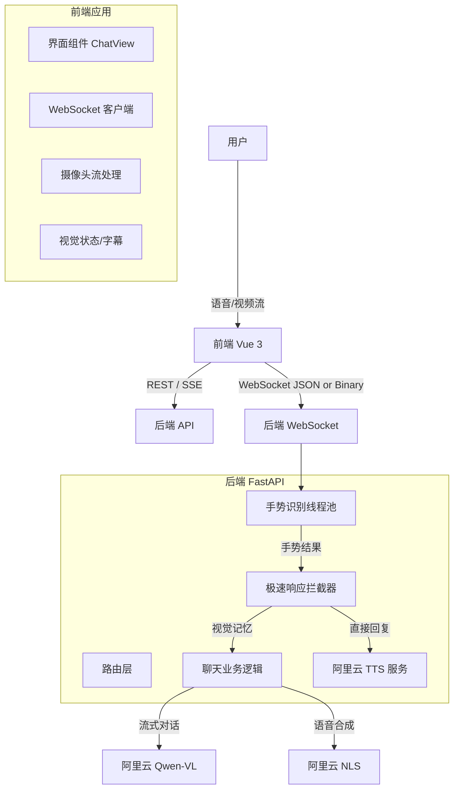
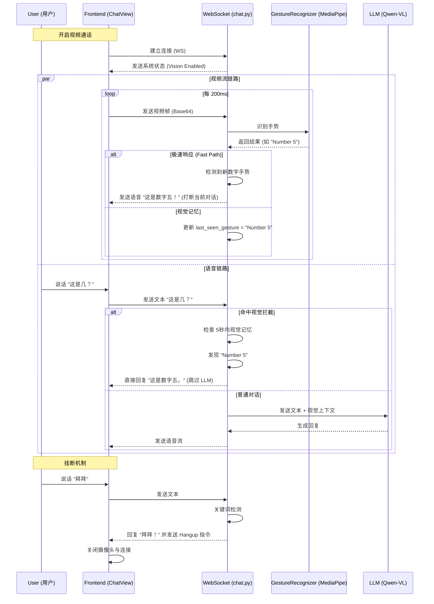

# KKChatBot-2 项目技术文档

## 1. 项目概述

KKChatBot-2 是一个基于 Vue 3 (前端) 和 FastAPI (后端) 构建的现代化 AI 聊天助手。它集成了**实时视频通话**、**手势识别**、**多模态交互**（文本/图片/视觉）、流式响应以及数字人视频状态反馈等高级功能。

**核心亮点**：
*   **实时视频通话**: 真正的 WebRTC 视频流传输，支持与 AI 数字人面对面交流。
*   **视觉感知 (Computer Vision)**: 集成 `MediaPipe`，能实时识别用户手势（如数字计数、比心）。
*   **极速响应 (Fast Path)**: 针对特定手势（如数字），后端直接拦截并毫秒级响应，无需等待大模型。
*   **多模态融合**: 视觉记忆与语言模型结合，支持“这是几？”等需要视觉上下文的自然问答。
*   **智能打断与挂断**: 支持语音/手势随时打断 AI 发言，支持“拜拜”语音自动挂断。

## 2. 系统架构

### 2.1 技术栈
*   **前端**: Vue 3, Vite, Axios, WebSocket (原生), CSS3 Animations
*   **后端**: Python 3.9 (Full Image), FastAPI, Uvicorn, SQLAlchemy (SQLite), Redis (可选)
*   **AI 服务**: 阿里云通义千问 (Qwen-VL-Max) 用于 LLM, 阿里云 NLS 用于 TTS (语音合成)
*   **计算机视觉**: `MediaPipe Hands` (Google), `OpenCV` (Headless)
*   **部署**: Docker, Docker Compose

### 2.2 核心流程图

#### 系统架构概览

#### 实时视频与手势交互流程 (核心)
这个流程图展示了用户视频通话时，视觉与语音的双链路处理机制。

## 3. 核心模块详解

### 3.1 后端 (Backend)

*   **手势识别 (`backend/app/services/gesture_recognition.py`)**:
    *   **鲁棒算法**: 
        *   使用几何特征（指尖与指关节距离比）而非简单的坐标阈值，支持任意角度的手势识别。
        *   **大拇指修正**: 引入指尖到小指根部的距离判断，彻底解决了“多算一根手指”的常见误判问题。
    *   **依赖管理**: 锁定 `mediapipe==0.10.9` 和 `protobuf==3.20.3`，确保在 Docker 环境下的稳定性。
    *   **线程池**: 所有的 CV 处理都在 `run_in_threadpool` 中执行，保证 WebSocket 主线程不阻塞。

*   **聊天逻辑 (`backend/app/api/chat.py`)**:
    *   **Fast Path Interception**: 在调用 LLM 之前，先检查是否命中“数字查询”或“挂断”意图，命中则直接返回，显著降低延迟。
    *   **视觉记忆 (Visual Memory)**: 缓存最近一次识别到的手势及其时间戳（有效期 5 秒），用于辅助回答“这是什么”等代词问题。
    *   **防抖动 (Debounce)**: 对连续相同的手势响应设置 3 秒冷却时间，防止 AI 变身复读机。

### 3.2 前端 (Frontend)

*   **视频通话视图 (`frontend/src/views/ChatView.vue`)**:
    *   **视觉状态指示器**: 右上角红/绿点实时显示后端视觉引擎是否就绪。
    *   **双视频流 UI**: 支持主画面与画中画 (PIP) 切换，默认 AI 为主画面。
    *   **状态机**: 
        *   `Sleeping` (常态): 汐宝睡觉。
        *   `Thinking` (视频中默认): 汐宝倾听/思考。
        *   `Talking` (回答中): 汐宝说话。
    *   **无感传输**: 视频帧经过压缩后通过 WebSocket 传输，保证低带宽下的流畅度。

## 4. 功能使用指南

### 4.1 开启视频通话
1.  点击聊天框右侧的 **📹 摄像头图标**。
2.  等待连接成功（右上角出现绿色“视觉已开启”提示）。
3.  此时你可以看到汐宝醒来并开始倾听。

### 4.2 手势互动
*   **数字识别**: 伸出 1-5 根手指（任意角度），汐宝会立即识别并语音播报（如“这是数字二，剪刀手！”）。
*   **特殊手势**: 比个“爱心”或“比心”，汐宝会有惊喜反应。
*   **组合问答**: 一边比划一边问“这是几？”，汐宝会根据看到的画面回答。

### 4.3 语音控制
*   **打断**: 汐宝说话时，你只需开口说话或做新手势，它会立即停止当前发言并回应你。
*   **挂断**: 对着麦克风说“拜拜”、“再见”或“挂断”，系统会自动结束通话。

## 5. 部署与维护

*   **启动命令**:
    *   后端: `docker-compose up -d backend` (推荐使用 Docker 以确保 CV 环境依赖正确)
    *   前端: `npm run dev`
*   **环境变量**: 复制 `.env.example` 到 `.env` 并填入阿里云 Key。
*   **注意事项**: 
    *   MediaPipe 需要 Python 3.9 环境，不要随意升级基础镜像。
    *   如果右上角显示“视觉初始化失败”，请检查后端日志 `docker-compose logs backend`。
